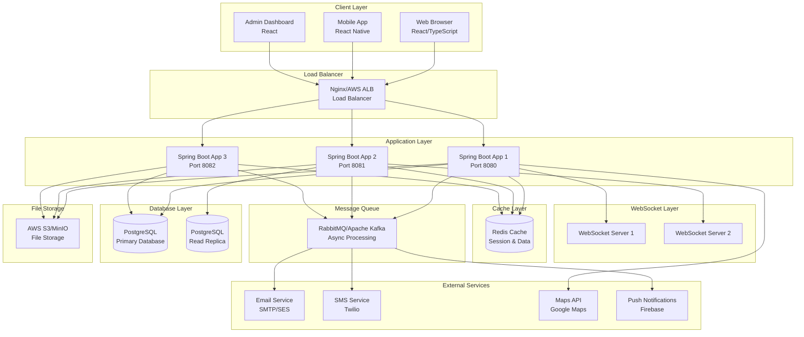
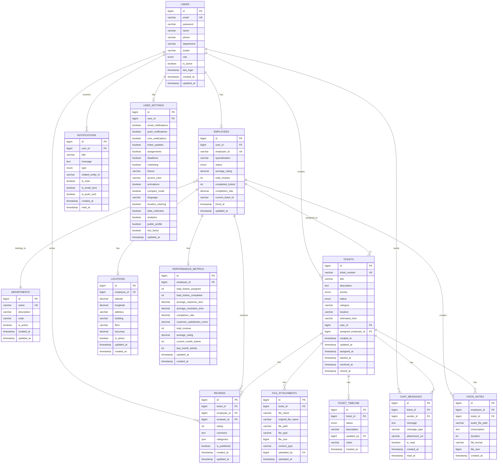
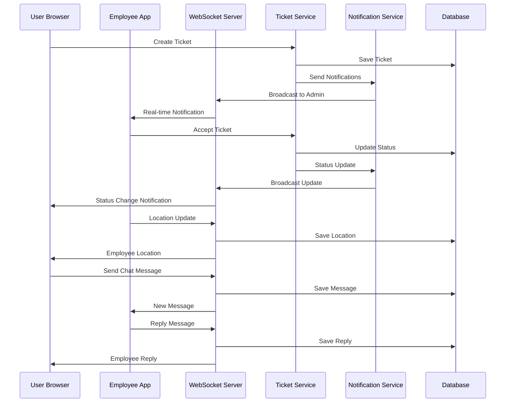
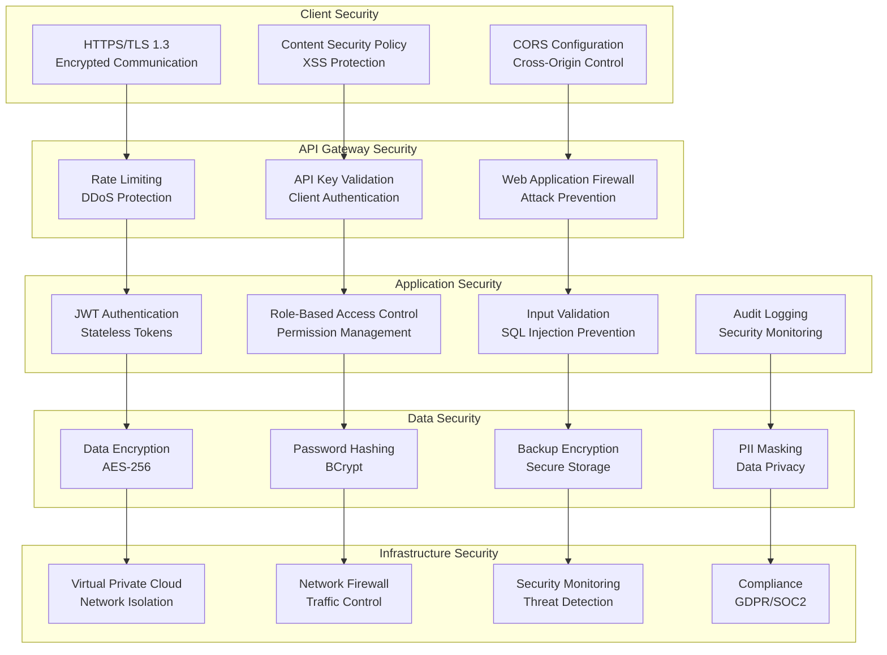
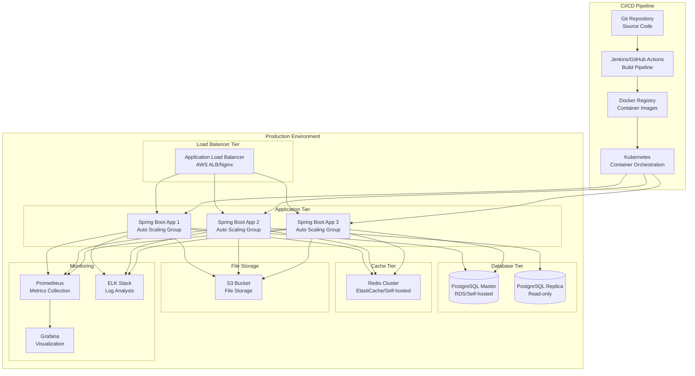
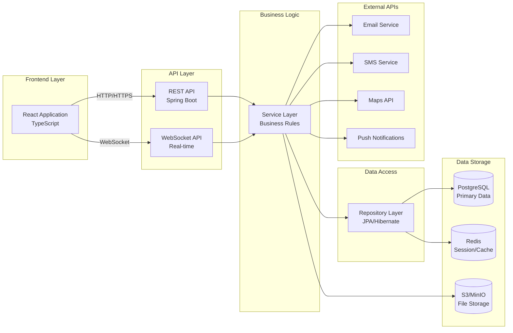

# System Architecture Diagrams - Service Ticket System

## 1. Overall System Architecture Diagram

## 2. Microservices Architecture (Future State)

```mermaid
graph TB
    subgraph "API Gateway"
        GATEWAY[Spring Cloud Gateway<br/>Routing & Security]
    end
    
    subgraph "Authentication Service"
        AUTH[Auth Service<br/>JWT & User Management]
        AUTH_DB[(Auth Database)]
    end
    
    subgraph "Ticket Service"
        TICKET[Ticket Service<br/>CRUD & Assignment]
        TICKET_DB[(Ticket Database)]
    end
    
    subgraph "Employee Service"
        EMP[Employee Service<br/>Management & Tracking]
        EMP_DB[(Employee Database)]
    end
    
    subgraph "Location Service"
        LOC[Location Service<br/>Real-time Tracking]
        LOC_DB[(Location Database)]
    end
    
    subgraph "Notification Service"
        NOTIF[Notification Service<br/>Multi-channel Alerts]
        NOTIF_DB[(Notification Database)]
    end
    
    subgraph "Review Service"
        REVIEW[Review Service<br/>Rating & Analytics]
        REVIEW_DB[(Review Database)]
    end
    
    subgraph "File Service"
        FILE[File Service<br/>Upload & Management]
        FILE_STORAGE[(File Storage)]
    end
    
    subgraph "Analytics Service"
        ANALYTICS[Analytics Service<br/>Reports & Insights]
        ANALYTICS_DB[(Analytics Database)]
    end
    
    subgraph "Service Discovery"
        EUREKA[Eureka Server<br/>Service Registry]
    end
    
    GATEWAY --> AUTH
    GATEWAY --> TICKET
    GATEWAY --> EMP
    GATEWAY --> LOC
    GATEWAY --> NOTIF
    GATEWAY --> REVIEW
    GATEWAY --> FILE
    GATEWAY --> ANALYTICS
    
    AUTH --> AUTH_DB
    TICKET --> TICKET_DB
    EMP --> EMP_DB
    LOC --> LOC_DB
    NOTIF --> NOTIF_DB
    REVIEW --> REVIEW_DB
    FILE --> FILE_STORAGE
    ANALYTICS --> ANALYTICS_DB
    
    AUTH --> EUREKA
    TICKET --> EUREKA
    EMP --> EUREKA
    LOC --> EUREKA
    NOTIF --> EUREKA
    REVIEW --> EUREKA
    FILE --> EUREKA
    ANALYTICS --> EUREKA
```

## 3. Database Entity Relationship Diagram

## 4. Application Layer Architecture

```mermaid
graph TB
    subgraph "Presentation Layer"
        CONTROLLER[Controllers<br/>REST Endpoints]
        WEBSOCKET[WebSocket Handlers<br/>Real-time Communication]
    end
    
    subgraph "Security Layer"
        JWT[JWT Filter<br/>Authentication]
        AUTHZ[Authorization<br/>Role-based Access]
    end
    
    subgraph "Business Logic Layer"
        AUTH_SERVICE[AuthService<br/>Login/Register]
        TICKET_SERVICE[TicketService<br/>CRUD/Assignment]
        EMP_SERVICE[EmployeeService<br/>Management/Tracking]
        REVIEW_SERVICE[ReviewService<br/>Rating/Analytics]
        LOC_SERVICE[LocationService<br/>Real-time Tracking]
        NOTIF_SERVICE[NotificationService<br/>Multi-channel Alerts]
        CHAT_SERVICE[ChatService<br/>Messaging]
        FILE_SERVICE[FileService<br/>Upload/Management]
        ANALYTICS_SERVICE[AnalyticsService<br/>Reports/Insights]
        SETTINGS_SERVICE[SettingsService<br/>User Preferences]
        AI_SERVICE[AIService<br/>Smart Suggestions]
        VOICE_SERVICE[VoiceService<br/>Voice Processing]
        EMAIL_SERVICE[EmailService<br/>Email Communication]
    end
    
    subgraph "Data Access Layer"
        USER_REPO[UserRepository]
        EMP_REPO[EmployeeRepository]
        TICKET_REPO[TicketRepository]
        REVIEW_REPO[ReviewRepository]
        LOC_REPO[LocationRepository]
        NOTIF_REPO[NotificationRepository]
        CHAT_REPO[ChatRepository]
        FILE_REPO[FileRepository]
        TIMELINE_REPO[TimelineRepository]
        SETTINGS_REPO[SettingsRepository]
        DEPT_REPO[DepartmentRepository]
        PERF_REPO[PerformanceRepository]
    end
    
    subgraph "External Integrations"
        EMAIL_PROVIDER[Email Provider<br/>SMTP/SES]
        SMS_PROVIDER[SMS Provider<br/>Twilio]
        MAPS_API[Maps API<br/>Google Maps]
        PUSH_PROVIDER[Push Provider<br/>Firebase]
        FILE_STORAGE[File Storage<br/>AWS S3/MinIO]
    end
    
    CONTROLLER --> JWT
    WEBSOCKET --> JWT
    JWT --> AUTHZ
    
    AUTHZ --> AUTH_SERVICE
    AUTHZ --> TICKET_SERVICE
    AUTHZ --> EMP_SERVICE
    AUTHZ --> REVIEW_SERVICE
    AUTHZ --> LOC_SERVICE
    AUTHZ --> NOTIF_SERVICE
    AUTHZ --> CHAT_SERVICE
    AUTHZ --> FILE_SERVICE
    AUTHZ --> ANALYTICS_SERVICE
    AUTHZ --> SETTINGS_SERVICE
    AUTHZ --> AI_SERVICE
    AUTHZ --> VOICE_SERVICE
    AUTHZ --> EMAIL_SERVICE
    
    AUTH_SERVICE --> USER_REPO
    TICKET_SERVICE --> TICKET_REPO
    EMP_SERVICE --> EMP_REPO
    REVIEW_SERVICE --> REVIEW_REPO
    LOC_SERVICE --> LOC_REPO
    NOTIF_SERVICE --> NOTIF_REPO
    CHAT_SERVICE --> CHAT_REPO
    FILE_SERVICE --> FILE_REPO
    ANALYTICS_SERVICE --> PERF_REPO
    SETTINGS_SERVICE --> SETTINGS_REPO
    
    EMAIL_SERVICE --> EMAIL_PROVIDER
    NOTIF_SERVICE --> SMS_PROVIDER
    LOC_SERVICE --> MAPS_API
    NOTIF_SERVICE --> PUSH_PROVIDER
    FILE_SERVICE --> FILE_STORAGE
```

## 5. Real-time Communication Flow

## 6. Security Architecture Diagram

## 7. Deployment Architecture

## 8. Data Flow Architecture

These comprehensive diagrams provide a complete visual representation of the system architecture, covering all aspects from high-level system design to detailed component interactions, security layers, and deployment strategies.